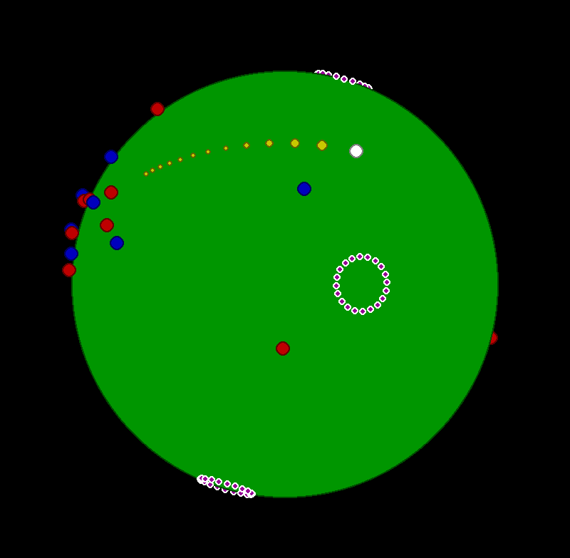

# spherical_billiards
Billiards on a spherical table, written using pygame. 



Try it online - [https://mathewkj2048.github.io/spherical_billiards](https://mathewkj2048.github.io/spherical_billiards)

## Controls:

`w`,`s`: shot power  
`a`,`d`: shot direction  
`q`, `e`: fine control of shot direction  
`SPACE`: shoot 

`i`,`j`,`k`,`l`,`u`,`o`: camera orientation  
`m`: reset camera   

## Installation:

Clone the repository and run the following command:

```
python ./src/main.py
```


